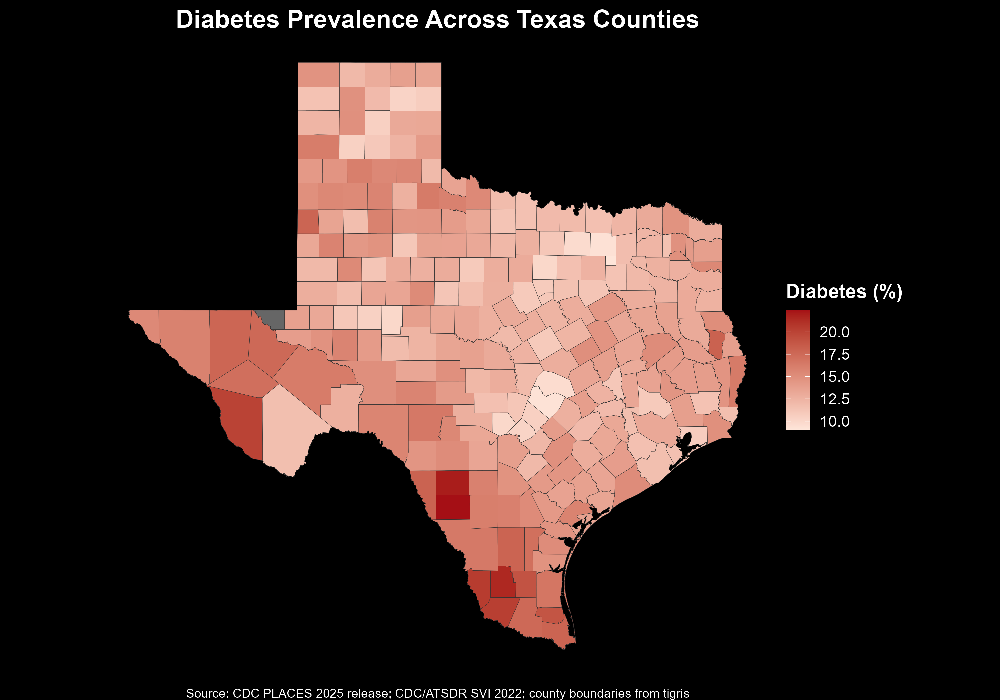
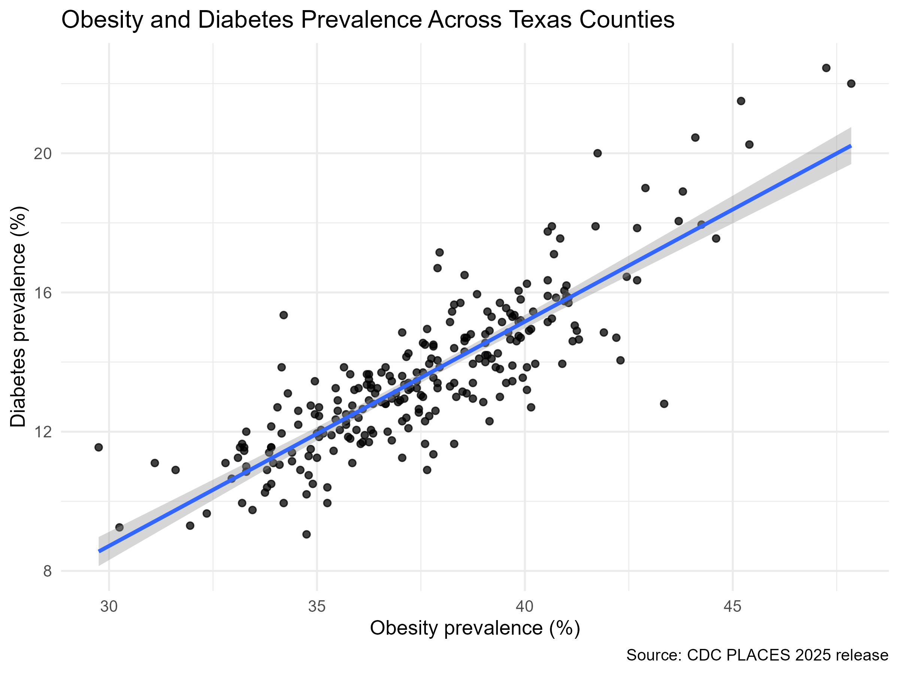
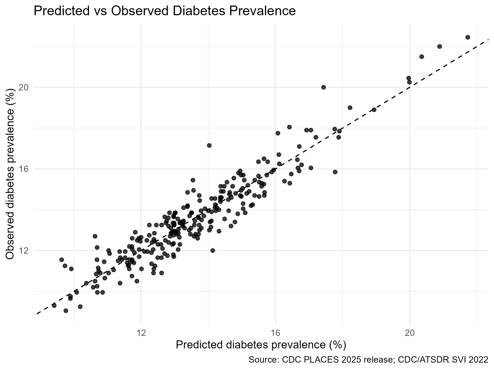

# Texas Chronic Disease Risk Factor Analysis

## Overview

This project analyzes county-level chronic disease risk factors across Texas, focusing on diabetes prevalence and related predictors such as obesity, smoking, poverty, insurance access, and socioeconomic conditions.

The goal is to identify geographic and social patterns in chronic disease risk and present the results through reproducible data analysis, visualizations, and a Quarto report.

## Research Question

What county-level health and socioeconomic factors are associated with higher diabetes prevalence in Texas?

## Data Sources

This project uses publicly available health and demographic data, including:

- CDC PLACES chronic disease indicators
- American Community Survey demographic and socioeconomic measures
- Texas county geographic data

## Methods

The analysis includes:

- Data cleaning and merging
- County-level exploratory analysis
- Choropleth mapping
- Correlation analysis
- Regression modeling
- Predicted vs. observed model evaluation

## Key Visualizations

### Diabetes Prevalence Map



### Obesity vs. Diabetes



### Predicted vs. Observed Diabetes



## Final Report

The full Quarto report is available here:

[View HTML Report](report/texas_chronic_disease_report.html)

## Project Structure

```text
data_raw/         Raw source data
data_clean/       Cleaned datasets
data_processed/   Final processed analysis data
figures/          Maps and visualizations
tables/           Model and summary tables
report/           Quarto report files
scripts/          R scripts
output/           Exported outputs
